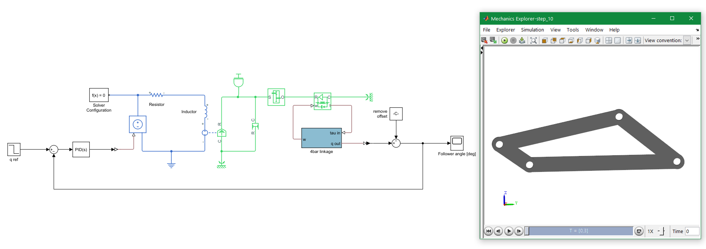

# training-simscape-4bars
Contains material for a lean Simscape course in which you can learn to control a four-bar linkage with a DC motor.

The course is organized in small steps, each of them with a dedicated Simulink file.

## 📋 Course outline
The training covers the following concepts:
 - Design and validation of a RL circuit with Simscape Electrical
 - Creating of a DC motor from the circuit
 - Design and validation of a simple mechanical model with Simscape Driveline
 - Motor speed control with a PID controller
 - Fundamentals of multibody systems with Simscape Multibody
 - Importing a complex CAD assembly in Simscape

## Detailed steps
1. Model a RL circuit and compare it with its related transfer function
2. Add an electromechanical conversion and add an inertia to create a simple motor
3. Add a damping parameter to the mechanical model
4. Add a constant opposing torque to simulate a load
5. Add a gearbox and compare to the block diagram
6. Add a simple PI control to move the motor to a desired speed
7. Replace the constant load with the inertia of a 3D multibody model
8. Import the four-bar linkage in the model and control the follower angle